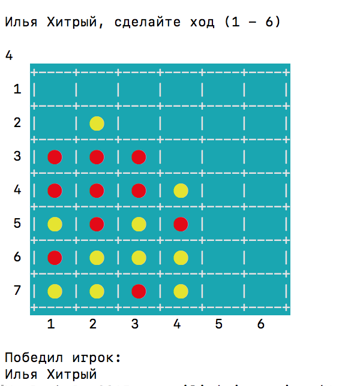

# Rotating Connect Four Game

Добро пожаловать в **Rotating Connect Four Game** – игру, которая перевернёт ваше представление о классической **"Четыре в ряд"**!

## Описание
Этот проект представляет собой расширенную версию классической игры **"Четыре в ряд"** с дополнительной механикой вращения игрового поля. После каждого хода доска может изменять свое положение, что добавляет элемент неожиданности, усложняя стратегию и создавая новые возможности для победы. Игра поддерживает до 4 игроков с разными цветами фишек.

## Основные возможности
✔ **Поддержка от 2 до 4 игроков**  
✔ **Выбор размера поля**
✔ **Случайное вращение доски** влево, вправо или вверх дном, возможное после каждого хода  
✔ **Анализ победных комбинаций** в реальном времени  
✔ **Консольный интерфейс с цветным отображением**  
✔ **Разные режимы запуска** (для IntelliJ IDEA и JAR-файла)  
✔ **Оптимизированный алгоритм проверки победы**  

## Как играть
1. Запустите игру.
2. Выберите количество игроков (от **2** до **4**).
3. Введите имена игроков и выберите цвета фишек.
4. Выберите размер игрового поля.
5. Игроки по очереди делают ходы:
    - Введите номер колонки (от 1 до ширины доски), в которую хотите поместить фишку.
    - Фишка падает вниз доски, как в классической игре "Четыре в ряд".
6. Поворот доски: После хода доска может случайным образом повернуться, что изменит расположение фишек.
7. Игра продолжается, пока один из игроков не соберёт 4 фишки в ряд (горизонтально, вертикально или по диагонали), или доска не заполнится.


## Пример игрового процесса
### Два игрока




### Четыре игрока


## Установка и запуск
### Требования к окружению
- **Java 17+**
- Терминал или консоль с поддержкой ANSI-цветов


### Запуск в IntelliJ IDEA
1. Импортируйте проект в вашу **IntelliJ IDEA**.
2. Запустите класс `MainForIdea.java`.

### Запуск с JAR-файлом
1. Скомпилируйте проект и соберите JAR-файл:
   ```bash
   gradlew build
   ```
2. Запустите игру командой:
   ```bash
   java -jar rotating_connect_four.jar
   ```

## Будущие улучшения и идеи
- **Графический интерфейс (GUI):** Перенос игры на Swing или JavaFX.
- **Онлайн-мультиплеер:** Возможность играть с друзьями через Интернет.
- **Поддержка мобильных платформ:** Разработка версии игры для iOS и Android.
- **Дополнительные режимы игры:** Введение новых правил и игровых режимов, например, турнирного режима со статистикой.


                        